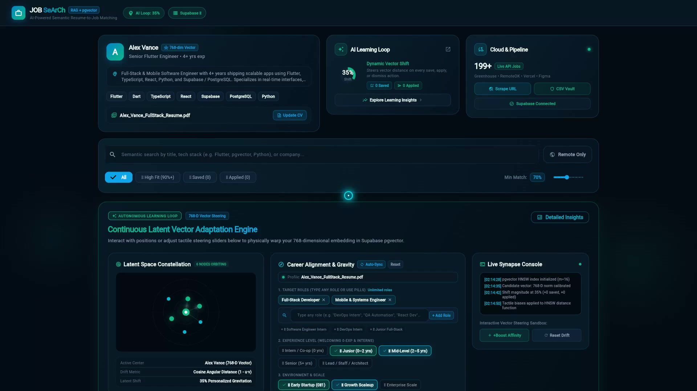
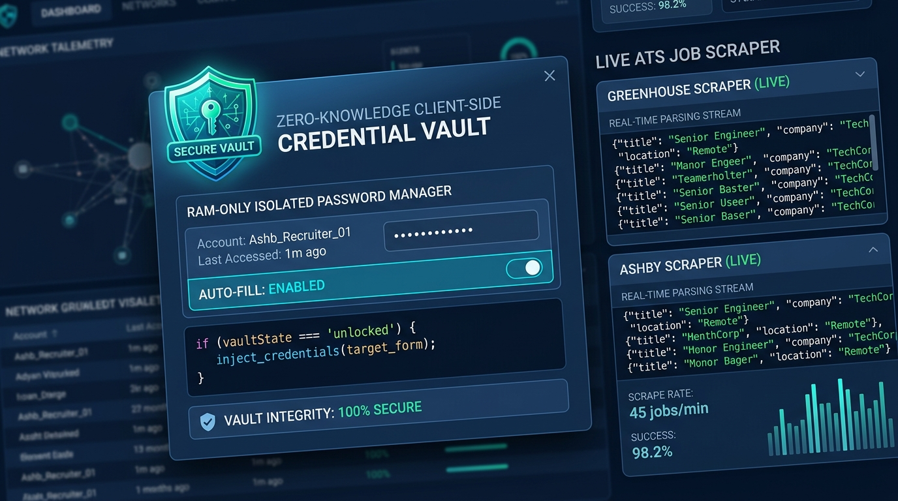
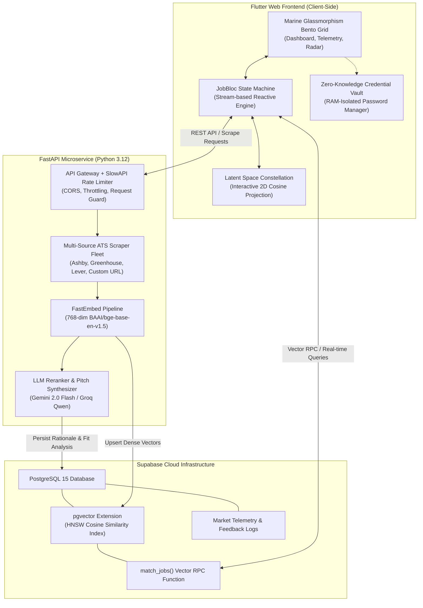

# 🚀 JOB SeArCh — Autonomous AI Job Hunting & Semantic Matching Engine

<p align="center">
  
  
  
  
  
  
  
  
</p>

<p align="center">
  <a href="https://joelaah.github.io/Job-Searcher/"><strong>🌐 Launch Live Web Application</strong></a> •
  <a href="docs/DEMO_WALKTHROUGH.md"><strong>🎬 Demo Reel & Walkthrough</strong></a> •
  <a href="docs/ARCHITECTURE.md"><strong>🏛️ Architecture Spec</strong></a> •
  <a href="docs/API_REFERENCE.md"><strong>🔌 API Reference</strong></a> •
  <a href="docs/SECURITY.md"><strong>🛡️ Security Model</strong></a>
</p>

---

## 🌟 Visual Showcase & Demonstrable Reel

<p align="center">
  <a href="docs/assets/demo_reel.mp4"><strong>🎬 Watch Full Demo Reel Video (MP4)</strong></a> •
  <a href="docs/assets/voiceover_demo.mp3"><strong>🎙️ Listen to AI Voiceover Track (MP3)</strong></a> •
  <a href="docs/DEMO_WALKTHROUGH.md"><strong>📜 Read Walkthrough Script</strong></a>
</p>

<p align="center">
  <a href="docs/assets/demo_reel.mp4">
    
  </a>
</p>
<p align="center"><em>Real-time desktop dashboard featuring the Marine Glassmorphism Bento Grid, 98% AI Match indicators, 2D Latent Space Constellation, and Market Salary Telemetry. (Click preview above or <a href="docs/assets/demo_reel.mp4">click here to watch the full 90-second Demo Reel</a>).</em></p>

<p align="center">
  
</p>
<p align="center"><em>RAM-only isolated credential assistant modal with 1-click auto-fill alongside real-time live ATS crawling streams.</em></p>

---

## 🧭 Executive Overview
**JOB SeArCh** is an intelligent, privacy-first career discovery and automated application system. Built for modern engineers, it eliminates generic job board spam by combining **deep semantic vector search**, an **adaptive reinforcement learning loop**, and a **Zero-Knowledge local credential vault** for rapid, private job applications.

Rather than relying on basic keyword matching, the engine projects candidate resumes and real-time scraped job postings into a shared **768-dimensional latent space**, calculating genuine contextual fit, identifying skill gaps, and generating personalized recruiter pitches.

---

## 🏛️ System Architecture



### Core Innovations
1. **Marine Glassmorphism Bento Grid**: Bespoke dark-mode UI (`#0A192F` navy with `#00E5FF` electric cyan and `#26A69A` seafoam accents) featuring real-time market salary telemetry, candidate percentile radar, and interactive filter strips.
2. **2D Latent Space Constellation Visualizer**: Canvas rendering cosine proximity between the candidate vector and live job clusters in dynamic orbit.
3. **Zero-Knowledge Local Credential Vault**: Candidate application logins exist solely within browser RAM. Passwords are never sent to the backend, database, or third parties. Includes 1-click clipboard auto-fill.
4. **Multi-Source Live ATS Scraper**: Headless extraction for **Ashby**, **Greenhouse**, and **Lever**, plus an arbitrary URL crawler with anti-bot fallback (`scrapling`).
5. **Adaptive Reinforcement Feedback**: Every candidate action (*Saved*, *Applied*, *Dismissed*) dynamically recalculates domain biases, tech-stack affinities, and seniority steering vectors in real time.

---

## ⚡ API & Backend Reference

The Python FastAPI backend exposes high-performance REST endpoints protected by IP rate limiting:

| Method | Endpoint | Rate Limit | Purpose |
| :--- | :--- | :--- | :--- |
| `GET` | `/api/health` | 60/min | System and scraper health telemetry |
| `POST` | `/api/scrape-url` | 10/min | Live headless extraction from an arbitrary careers URL |
| `POST` | `/api/scrape-all` | 2/hour | Batch synchronization across Greenhouse, Lever, and Ashby boards |

### Live URL Scraper Payload (`POST /api/scrape-url`)
```bash
curl -X POST "http://localhost:8000/api/scrape-url" \
  -H "Content-Type: application/json" \
  -d '{"url": "https://boards.greenhouse.io/figma", "max_jobs": 15}'
```
**Response (`200 OK`)**:
```json
{
  "status": "success",
  "url": "https://boards.greenhouse.io/figma",
  "count": 1,
  "jobs": [
    {
      "title": "Senior Systems Engineer",
      "company": "Figma",
      "location": "San Francisco, CA / Remote",
      "is_remote": true,
      "salary_min": 180000,
      "salary_max": 220000,
      "job_url": "https://boards.greenhouse.io/figma/jobs/...",
      "description": "Building high-performance collaborative graphics engines...",
      "tags": ["C++", "Rust", "WebAssembly", "Live Scraped"],
      "source": "greenhouse",
      "posted_at": "2026-03-30"
    }
  ]
}
```
*For complete endpoint schemas and cURL examples, see [`docs/API_REFERENCE.md`](docs/API_REFERENCE.md).*

---

## 🛡️ Security & Privacy Considerations

- **Zero-Knowledge RAM-Only Isolation**: Passwords and application credentials loaded via CSV exist **only within Dart runtime heap memory**. No cookies, `localStorage`, `sessionStorage`, or backend databases store sensitive credentials. Refreshing the browser tab purges the heap immediately.
- **Anti-SSRF Protections**: Scraper endpoints reject loopback and private IP blocks (`127.0.0.1`, `10.0.0.0/8`, `192.168.0.0/16`, `169.254.169.254`), permitting only valid public `http://` and `https://` schemas.
- **Rate-Limiting Defense**: Outbound scraping and inbound queries are guarded by `slowapi` to prevent abuse.
- **Supabase RLS & Key Separation**: Anonymous client tokens are restricted by Row Level Security; service-role privileges reside strictly on the private server.
- *Detailed security disclosures available in [`docs/SECURITY.md`](docs/SECURITY.md).*

---

## 🧪 Automated Testing & Verification

Both the frontend client and the Python backend feature automated test suites verifying data models, state transitions, parsing logic, and API endpoints.

### Run Flutter Test Suite (10/10 Passing)
```bash
# Runs JobModel, LocalCredential, and Desktop smoke tests
flutter test
```
```
00:00 +0: loading D:/job searcher/test/job_model_test.dart
00:00 +1: JobModel Unit Tests JobModel.formattedSalary formats ranges correctly
00:00 +2: JobModel Unit Tests JobModel.formattedSalary returns "Competitive" when salaries are zero
00:00 +3: JobModel Unit Tests JobModel.copyWith correctly updates interaction flags
00:00 +4: JobModel Unit Tests JobModel.fromScrapedJson parses live scraper payload accurately
00:00 +5: JobModel Unit Tests JobModel.fromScrapedJson provides graceful defaults for empty payload
00:05 +6: LocalCredential Unit Tests LocalCredential initializes correctly with provided values
00:05 +7: LocalCredential Unit Tests LocalCredential.fromMap handles standard CSV headers
00:05 +8: LocalCredential Unit Tests LocalCredential.fromMap handles alias column keys gracefully
00:05 +9: LocalCredential Unit Tests LocalCredential.copyWith updates specific properties without mutation
00:09 +10: JOB SeArCh desktop smoke test
00:13 +10: All tests passed!
```

### Run Python Backend Test Suite (5/5 Passing)
```bash
cd backend
python -m unittest test_server.py
```
```
.....
----------------------------------------------------------------------
Ran 5 tests in 0.139s

OK
```

---

## 🚀 Getting Started Locally

### Prerequisites
- [Flutter SDK](https://docs.flutter.dev/get-started/install) (v3.22+ recommended)
- [Python](https://www.python.org/) 3.10+
- Free [Supabase Account](https://supabase.com/) & [Google AI Studio Key](https://aistudio.google.com/apikey)

### 1. Clone the Repository
```bash
git clone https://github.com/joelaah/job-searcher.git
cd job-searcher
```

### 2. Configure Environment Variables
Copy `.env.example` in the `backend/` directory:
```bash
cp backend/.env.example backend/.env
```
Fill in your credentials:
```env
SUPABASE_URL=https://your-project.supabase.co
SUPABASE_KEY=your-supabase-anon-or-secret-key
GEMINI_API_KEY=your-gemini-api-key
GROQ_API_KEY=your-groq-api-key
```

### 3. Initialize the Database
Open your Supabase **SQL Editor**, paste the contents of [`backend/db_schema.sql`](backend/db_schema.sql), and click **Run**.

### 4. Start the Python Backend Service
```bash
cd backend
pip install -r requirements.txt
uvicorn server:app --reload --port 8000
```

### 5. Launch the Flutter Web Frontend
```bash
# In the project root directory
flutter pub get
flutter run -d chrome --web-port=5000
```
Open **`http://localhost:5000/`** in your browser.

---

## 🌐 Deployment to GitHub Pages

The repository includes a GitHub Actions workflow (`.github/workflows/deploy.yml`):
- Pushing to `main` builds the Flutter Web application in release mode.
- Deployed live at: **[`https://joelaah.github.io/Job-Searcher/`](https://joelaah.github.io/Job-Searcher/)**

---

## 🔐 Data Storage, Session Persistence & PWA Architecture

JOB SeArCh is architected with a privacy-first, frictionless access model engineered for recruiters and candidates alike:

| Layer | Technology | Storage Scope & Security Guarantee |
|:--|:--|:--|
| **Client Session Persistence** | `shared_preferences` / Browser `localStorage` | **Instant Resume & Persistence**: Saved roles, application status (`applied`, `dismissed`), and scraped job caches persist across page reloads without forcing mandatory account sign-up. |
| **Credential Assistant** | Volatile RAM Isolated Vault | **Zero-Knowledge**: Candidate application portal logins remain strictly in browser memory. Passwords and credentials never touch network requests, FastAPI logs, or Supabase tables. |
| **Vector Engine** | Supabase `pgvector` (PostgreSQL 15) | **HNSW Cosine Similarity**: 768-dimensional job embeddings queryable via secure database RPC functions (`match_jobs`) with sub-millisecond similarity retrieval. |
| **PWA Installability** | Web Manifest + Service Worker | **Standalone App Experience**: Installable as a native desktop or mobile app directly from Chrome/Edge/Safari with branded Marine Glassmorphism theme shell (`#040C12` background, `#0EA5E9` cyan theme). |

### 📲 Progressive Web App (PWA) Installation
Recruiters and candidates can install JOB SeArCh directly without app store friction:
- **Desktop (Chrome / Edge / Brave)**: Click the **Install JOB SeArCh** icon in the URL omnibox or menu -> **Install**.
- **Mobile (iOS Safari)**: Tap **Share** -> **Add to Home Screen**.
- **Mobile (Android Chrome)**: Tap **Install App** on the install banner.
Once installed, it runs in a dedicated standalone window with zero browser chrome, full desktop multitasking, and instant launch capability.

---

## 🛠️ Technology Stack

| Layer | Technologies |
| :--- | :--- |
| **Frontend Web** | Flutter Web 3.x, Dart 3, `flutter_bloc`, `google_fonts`, Glassmorphism CSS |
| **Backend API** | Python 3.12, FastAPI, Uvicorn, SlowAPI, Pydantic |
| **Database & Vector Tier** | Supabase, PostgreSQL 15, `pgvector`, HNSW Cosine Index |
| **AI & Embeddings** | FastEmbed (`BAAI/bge-base-en-v1.5`), Google Gemini 2.0 Flash, Groq (`qwen/qwen3.8-27b`) |
| **Scraping Engine** | BeautifulSoup4, lxml, Requests, Scrapling stealth fetchers |
| **Testing** | Flutter Test framework, Python `unittest`, FastAPI `TestClient` |
| **CI/CD** | GitHub Actions, GitHub Pages |

---

## 📄 License
This project is licensed under the MIT License — see the [LICENSE](LICENSE) file for details.
