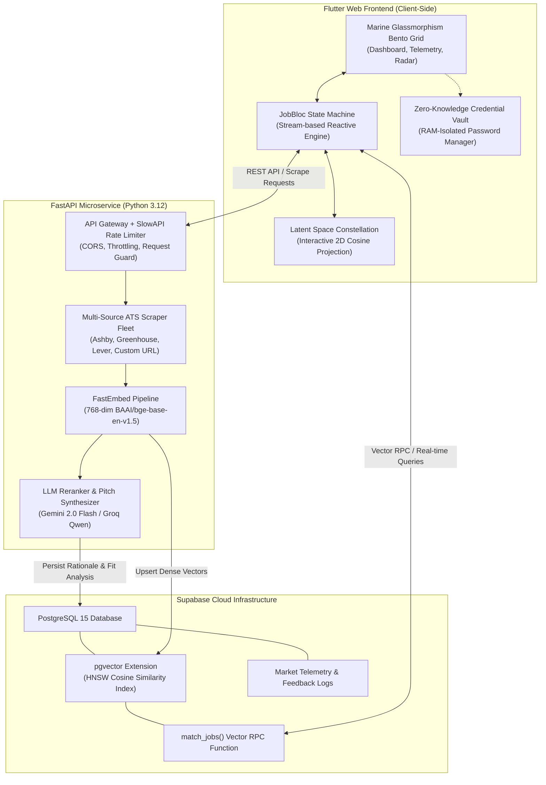
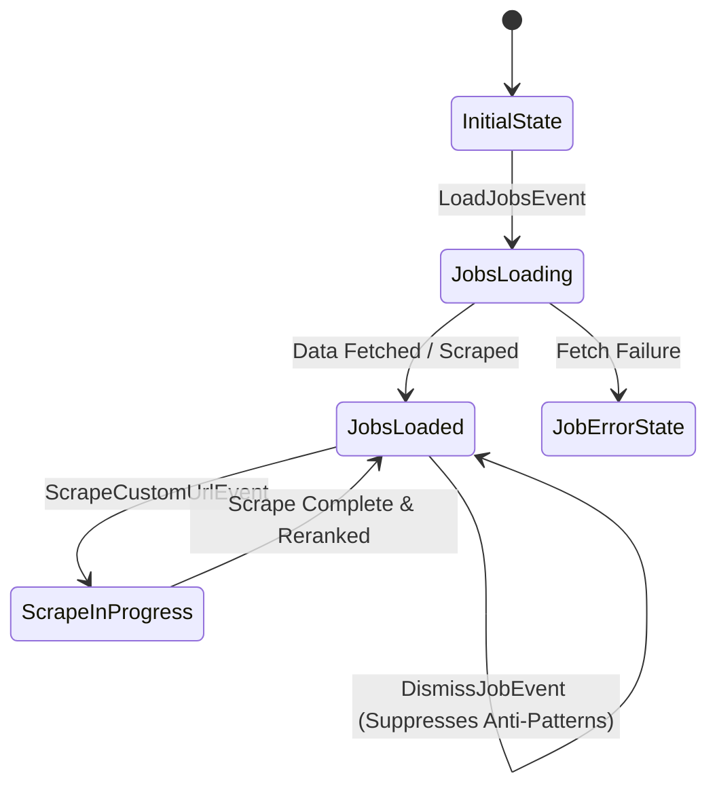

# 🏛️ JOB SeArCh — System Architecture & Engineering Design

This document provides an exhaustive technical breakdown of **JOB SeArCh**, an autonomous, privacy-first career discovery and intelligent matching platform designed for modern engineers.

---

## 🧭 High-Level System Architecture



---

## 🎨 1. Frontend Architecture & Design Philosophy

### 1.1 Marine Glassmorphism Design System
The frontend is constructed with a bespoke design system implemented in `lib/theme/app_colors.dart` and `lib/theme/app_theme.dart`:
- **Palette**:
  - Background: Obsidian Navy (`#0A192F` / `#0D1B2A`)
  - Accent Cyan: Electric Cyan (`#00E5FF`) representing vector proximity and real-time connectivity.
  - Accent Seafoam: Deep Marine Green (`#26A69A`) symbolizing career growth and validated qualifications.
  - Card Glass: Semi-transparent backdrop filters (`rgba(16, 37, 66, 0.65)` with 20px blur and 1px radial borders).
- **Responsive Bento Layout**:
  - Adaptive multi-column grid (`BentoHeroJobCard`, `BentoMarketInsightsCard`, `BentoPipelineCard`, `BentoTelemetryCard`).
  - Mobile, tablet, and ultra-wide monitor responsive breakpoints.

### 1.2 BLoC Reactive State Machine
State transitions are governed by `flutter_bloc` (`lib/bloc/job_bloc.dart`), guaranteeing deterministic uni-directional data flow:



### 1.3 2D Latent Space Constellation Visualizer
Located in `lib/widgets/latent_space_constellation.dart`:
- Projects candidate resume embeddings and target role vectors onto an interactive 2D canvas using normalized cosine coordinates.
- **Node Physics**: Renders the candidate as the central gravitational anchor, with job nodes orbiting at radial distances inverse to their semantic match score $S = \cos(\theta)$.
- Interactivity: Hovering or selecting any celestial node reveals instantaneous match breakdown, skill overlap, and salary bracket.

---

## 🧠 2. Semantic Matching & Feedback Loop

### 2.1 Embedding Projection Pipeline
Every job posting title, description, and qualification set is stripped of HTML markup and normalized before entering the embedding pipeline:
1. **Model**: `BAAI/bge-base-en-v1.5` dense representation (768 dimensions).
2. **Indexing**: Indexed in Supabase PostgreSQL using an HNSW (Hierarchical Navigable Small World) index:
   ```sql
   CREATE INDEX ON jobs 
   USING hnsw (embedding vector_cosine_ops)
   WITH (m = 16, ef_construction = 64);
   ```
3. **Similarity Calculation**:
   $$\text{Cosine Similarity} = \frac{\mathbf{u} \cdot \mathbf{v}}{\|\mathbf{u}\|_2 \|\mathbf{v}\|_2}$$

### 2.2 Adaptive Reinforcement Learning Loop
User interactions continuously update candidate steering preferences:
- **Save Event**: Boosts the weight of the job's domain tags and company archetype by $+0.15$.
- **Apply Event**: Strengthens technical stack affinity by $+0.30$.
- **Dismiss Event**: Deducts $-0.40$ from matching cluster keywords, effectively penalizing irrelevant roles in future vector search queries.

---

## ⚡ 3. Multi-Source ATS Scraping Engine

The backend scraper fleet (`backend/scraper.py`) features dedicated extractors for major Applicant Tracking Systems:
- **Greenhouse Scraper**: Consumes public board endpoints `https://boards-api.greenhouse.io/v1/boards/{company}/jobs` without requiring API authentication tokens.
- **Lever Scraper**: Consumes public posting feeds `https://api.lever.co/v0/postings/{company}?mode=json`.
- **Ashby Scraper**: Queries live public recruitment manifests `https://api.ashbyhq.com/posting-api/job-board/{company}`.
- **Generic URL Crawler**: Uses BeautifulSoup4 and Scrapling stealth fetchers to crawl custom career pages, parsing salary regex patterns, remote eligibility tags, and clean job descriptions.
